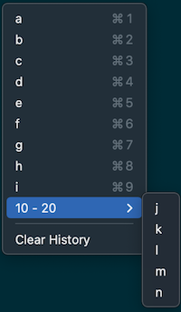

# CopyHistory

A small app to record copies, and allow you to quickly paste them from a
menu invoked by CTRL+CMD+V.

## Acknowledgements

This workflow was born for me from [ClipMenu](http://www.clipmenu.com)
and was followed up by [Clipy](https://github.com/Clipy/Clipy) if you
want more features.

I wrote this app to be the most stable version of this workflow reducing
the risk of breaking with new OS releases.
